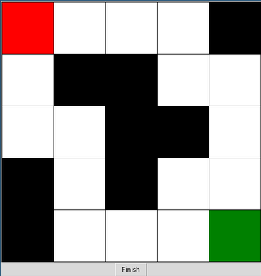

# Q Learning Agent

This application were made as my little practice of Q Learning algorithm.
Goal of sharing it is hope that it might help someone else to better understand Q Learning plus it's funny to watch your agent evolve.
Application may contain bugs, so feel free to report them :).


## Screenshots


## How to run?
Python3 is required to run this application.
```bash
git clone https://github.com/mvujas/Q-Learning-Agent
cd Q-Learning-Agent/
python run.py
```
